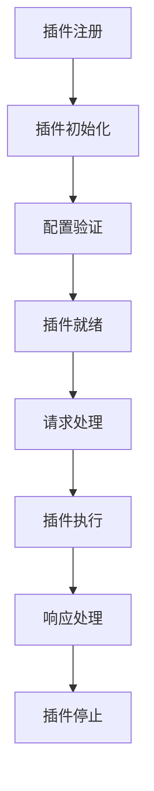

# 插件开发指南

## 概述

Gateway-Go 采用插件化架构，支持自定义插件开发。本文档详细介绍如何开发、测试和部署自定义插件。

## 插件架构

### 插件接口

所有插件都必须实现 `core.Plugin` 接口：

```go
package core

import (
    "github.com/gin-gonic/gin"
)

// Plugin 插件接口
type Plugin interface {
    // Name 返回插件名称
    Name() string
    
    // Init 初始化插件
    Init(config map[string]interface{}) error
    
    // Execute 执行插件逻辑
    Execute(ctx *gin.Context) error
    
    // Order 返回插件执行顺序
    Order() int
    
    // Stop 停止插件
    Stop() error
    
    // GetDependencies 返回插件依赖
    GetDependencies() []string
}
```

### 插件生命周期



## 开发环境准备

### 1. 项目结构

```
gateway-go/
├── internal/
│   └── plugin/
│       ├── core/
│       │   └── interface.go      # 插件接口定义
│       ├── plugins/
│       │   └── yourplugin/       # 你的插件目录
│       │       ├── yourplugin.go # 插件实现
│       │       ├── config.go     # 配置结构
│       │       └── README.md     # 插件文档
│       └── manager.go            # 插件管理器
```

### 2. 依赖管理

确保你的插件依赖已添加到 `go.mod`：

```go
module gateway-go

go 1.16

require (
    github.com/gin-gonic/gin v1.7.7
    github.com/spf13/viper v1.12.0
    // 其他依赖...
)
```

## 插件开发步骤

### 步骤 1: 创建插件目录

```bash
mkdir -p internal/plugin/plugins/yourplugin
cd internal/plugin/plugins/yourplugin
```

### 步骤 2: 定义配置结构

创建 `config.go`：

```go
package yourplugin

// Config 插件配置结构
type Config struct {
    Enabled bool   `yaml:"enabled" json:"enabled"`
    Option  string `yaml:"option" json:"option"`
    Timeout int    `yaml:"timeout" json:"timeout"`
    
    // 高级配置
    Advanced struct {
        Retries    int    `yaml:"retries" json:"retries"`
        CacheSize  int    `yaml:"cache_size" json:"cache_size"`
        LogLevel   string `yaml:"log_level" json:"log_level"`
    } `yaml:"advanced" json:"advanced"`
}

// DefaultConfig 返回默认配置
func DefaultConfig() *Config {
    return &Config{
        Enabled: true,
        Option:  "default",
        Timeout: 30,
        Advanced: struct {
            Retries   int    `yaml:"retries" json:"retries"`
            CacheSize int    `yaml:"cache_size" json:"cache_size"`
            LogLevel  string `yaml:"log_level" json:"log_level"`
        }{
            Retries:   3,
            CacheSize: 1000,
            LogLevel:  "info",
        },
    }
}
```

### 步骤 3: 实现插件

创建 `yourplugin.go`：

```go
package yourplugin

import (
    "encoding/json"
    "fmt"
    "net/http"
    "time"
    
    "gateway-go/internal/plugin/core"
    "github.com/gin-gonic/gin"
    "github.com/sirupsen/logrus"
)

// Plugin 自定义插件实现
type Plugin struct {
    config *Config
    logger *logrus.Logger
    cache  map[string]interface{}
}

// New 创建插件实例
func New() *Plugin {
    return &Plugin{
        config: DefaultConfig(),
        logger: logrus.New(),
        cache:  make(map[string]interface{}),
    }
}

// Name 返回插件名称
func (p *Plugin) Name() string {
    return "your_plugin"
}

// Init 初始化插件
func (p *Plugin) Init(config map[string]interface{}) error {
    // 解析配置
    configBytes, err := json.Marshal(config)
    if err != nil {
        return fmt.Errorf("failed to marshal config: %w", err)
    }
    
    if err := json.Unmarshal(configBytes, p.config); err != nil {
        return fmt.Errorf("failed to unmarshal config: %w", err)
    }
    
    // 验证配置
    if err := p.validateConfig(); err != nil {
        return fmt.Errorf("invalid config: %w", err)
    }
    
    // 初始化组件
    if err := p.initialize(); err != nil {
        return fmt.Errorf("failed to initialize: %w", err)
    }
    
    p.logger.Infof("Plugin %s initialized successfully", p.Name())
    return nil
}

// Execute 执行插件逻辑
func (p *Plugin) Execute(ctx *gin.Context) error {
    if !p.config.Enabled {
        return nil // 插件未启用，跳过执行
    }
    
    start := time.Now()
    
    // 前置处理
    if err := p.beforeExecute(ctx); err != nil {
        return fmt.Errorf("before execute failed: %w", err)
    }
    
    // 主要逻辑
    if err := p.process(ctx); err != nil {
        return fmt.Errorf("process failed: %w", err)
    }
    
    // 后置处理
    if err := p.afterExecute(ctx); err != nil {
        return fmt.Errorf("after execute failed: %w", err)
    }
    
    // 记录执行时间
    duration := time.Since(start)
    p.logger.Debugf("Plugin %s executed in %v", p.Name(), duration)
    
    return nil
}

// Order 返回插件执行顺序
func (p *Plugin) Order() int {
    return 50 // 中等优先级
}

// Stop 停止插件
func (p *Plugin) Stop() error {
    p.logger.Infof("Stopping plugin %s", p.Name())
    
    // 清理资源
    p.cache = nil
    
    p.logger.Infof("Plugin %s stopped successfully", p.Name())
    return nil
}

// GetDependencies 返回插件依赖
func (p *Plugin) GetDependencies() []string {
    return []string{} // 无依赖
}

// 私有方法

func (p *Plugin) validateConfig() error {
    if p.config.Timeout <= 0 {
        return fmt.Errorf("timeout must be positive")
    }
    
    if p.config.Advanced.Retries < 0 {
        return fmt.Errorf("retries cannot be negative")
    }
    
    return nil
}

func (p *Plugin) initialize() error {
    // 设置日志级别
    level, err := logrus.ParseLevel(p.config.Advanced.LogLevel)
    if err != nil {
        return fmt.Errorf("invalid log level: %w", err)
    }
    p.logger.SetLevel(level)
    
    // 初始化缓存
    p.cache = make(map[string]interface{}, p.config.Advanced.CacheSize)
    
    return nil
}

func (p *Plugin) beforeExecute(ctx *gin.Context) error {
    // 检查请求头
    if ctx.GetHeader("X-Skip-Your-Plugin") == "true" {
        return fmt.Errorf("plugin execution skipped")
    }
    
    // 记录请求信息
    p.logger.Debugf("Processing request: %s %s", ctx.Request.Method, ctx.Request.URL.Path)
    
    return nil
}

func (p *Plugin) process(ctx *gin.Context) error {
    // 示例：添加自定义请求头
    ctx.Header("X-Your-Plugin", "processed")
    
    // 示例：修改请求参数
    if ctx.Query("option") == "" {
        ctx.Request.URL.RawQuery += "&option=" + p.config.Option
    }
    
    // 示例：缓存处理
    cacheKey := ctx.Request.URL.String()
    if cached, exists := p.cache[cacheKey]; exists {
        ctx.JSON(http.StatusOK, cached)
        return nil
    }
    
    return nil
}

func (p *Plugin) afterExecute(ctx *gin.Context) error {
    // 示例：记录响应信息
    p.logger.Debugf("Response status: %d", ctx.Writer.Status())
    
    // 示例：缓存响应
    if ctx.Writer.Status() == http.StatusOK {
        cacheKey := ctx.Request.URL.String()
        // 这里可以缓存响应数据
        p.cache[cacheKey] = "cached_response"
    }
    
    return nil
}
```

### 步骤 4: 注册插件

在主程序中注册插件：

```go
// cmd/gateway/main.go
package main

import (
    "gateway-go/internal/plugin/plugins/yourplugin"
    // 其他导入...
)

func init() {
    // 注册插件
    pluginManager.Register(yourplugin.New())
}
```

### 步骤 5: 配置插件

在配置文件中添加插件配置：

```yaml
plugins:
  available:
    - name: your_plugin
      enabled: true
      order: 50
      config:
        enabled: true
        option: "custom_value"
        timeout: 30
        advanced:
          retries: 3
          cache_size: 1000
          log_level: "info"

routes:
  - name: api-service
    match:
      type: prefix
      path: /api
    target:
      url: http://backend:8080
    plugins: ["your_plugin"]  # 使用你的插件
```

## 高级插件开发

### 1. 插件依赖

如果插件依赖其他插件，实现依赖管理：

```go
func (p *Plugin) GetDependencies() []string {
    return []string{"auth", "logger"}
}

func (p *Plugin) Init(config map[string]interface{}) error {
    // 检查依赖插件是否已加载
    if !p.checkDependencies() {
        return fmt.Errorf("required dependencies not found")
    }
    
    // 其他初始化逻辑...
    return nil
}

func (p *Plugin) checkDependencies() bool {
    // 检查依赖插件是否存在
    return true
}
```

### 2. 插件配置验证

实现严格的配置验证：

```go
func (p *Plugin) validateConfig() error {
    // 必需字段验证
    if p.config.Option == "" {
        return fmt.Errorf("option is required")
    }
    
    // 数值范围验证
    if p.config.Timeout < 1 || p.config.Timeout > 300 {
        return fmt.Errorf("timeout must be between 1 and 300 seconds")
    }
    
    // 枚举值验证
    validOptions := []string{"option1", "option2", "option3"}
    valid := false
    for _, opt := range validOptions {
        if p.config.Option == opt {
            valid = true
            break
        }
    }
    if !valid {
        return fmt.Errorf("invalid option: %s", p.config.Option)
    }
    
    return nil
}
```

### 3. 插件状态管理

实现插件状态管理：

```go
type PluginState int

const (
    StateUninitialized PluginState = iota
    StateInitialized
    StateRunning
    StateStopped
    StateError
)

type Plugin struct {
    config *Config
    state  PluginState
    mutex  sync.RWMutex
    // 其他字段...
}

func (p *Plugin) GetState() PluginState {
    p.mutex.RLock()
    defer p.mutex.RUnlock()
    return p.state
}

func (p *Plugin) setState(state PluginState) {
    p.mutex.Lock()
    defer p.mutex.Unlock()
    p.state = state
}
```

### 4. 插件指标收集

实现插件指标收集：

```go
type Metrics struct {
    RequestCount    int64
    ErrorCount      int64
    ExecutionTime   time.Duration
    CacheHitCount   int64
    CacheMissCount  int64
}

type Plugin struct {
    config  *Config
    metrics *Metrics
    mutex   sync.RWMutex
    // 其他字段...
}

func (p *Plugin) GetMetrics() *Metrics {
    p.mutex.RLock()
    defer p.mutex.RUnlock()
    return p.metrics
}

func (p *Plugin) recordMetrics(duration time.Duration, err error) {
    p.mutex.Lock()
    defer p.mutex.Unlock()
    
    p.metrics.RequestCount++
    p.metrics.ExecutionTime = duration
    
    if err != nil {
        p.metrics.ErrorCount++
    }
}
```

## 插件测试

### 1. 单元测试

创建 `yourplugin_test.go`：

```go
package yourplugin

import (
    "net/http"
    "net/http/httptest"
    "testing"
    
    "github.com/gin-gonic/gin"
    "github.com/stretchr/testify/assert"
)

func TestPlugin_Init(t *testing.T) {
    plugin := New()
    
    config := map[string]interface{}{
        "enabled": true,
        "option":  "test",
        "timeout": 30,
    }
    
    err := plugin.Init(config)
    assert.NoError(t, err)
    assert.True(t, plugin.config.Enabled)
    assert.Equal(t, "test", plugin.config.Option)
}

func TestPlugin_Execute(t *testing.T) {
    plugin := New()
    
    // 初始化插件
    config := map[string]interface{}{
        "enabled": true,
        "option":  "test",
        "timeout": 30,
    }
    err := plugin.Init(config)
    assert.NoError(t, err)
    
    // 创建测试请求
    gin.SetMode(gin.TestMode)
    router := gin.New()
    router.Use(func(c *gin.Context) {
        err := plugin.Execute(c)
        if err != nil {
            c.AbortWithError(http.StatusInternalServerError, err)
        }
    })
    router.GET("/test", func(c *gin.Context) {
        c.JSON(http.StatusOK, gin.H{"message": "success"})
    })
    
    // 发送请求
    req, _ := http.NewRequest("GET", "/test", nil)
    w := httptest.NewRecorder()
    router.ServeHTTP(w, req)
    
    assert.Equal(t, http.StatusOK, w.Code)
    assert.Contains(t, w.Header().Get("X-Your-Plugin"), "processed")
}

func TestPlugin_ConfigValidation(t *testing.T) {
    plugin := New()
    
    // 测试无效配置
    invalidConfig := map[string]interface{}{
        "enabled": true,
        "timeout": -1, // 无效的超时值
    }
    
    err := plugin.Init(invalidConfig)
    assert.Error(t, err)
    assert.Contains(t, err.Error(), "timeout must be positive")
}
```

### 2. 集成测试

创建集成测试：

```go
func TestPlugin_Integration(t *testing.T) {
    // 启动测试服务器
    server := httptest.NewServer(http.HandlerFunc(func(w http.ResponseWriter, r *http.Request) {
        w.WriteHeader(http.StatusOK)
        w.Write([]byte(`{"status":"ok"}`))
    }))
    defer server.Close()
    
    // 创建网关实例
    gateway := createTestGateway()
    
    // 配置插件
    config := &Config{
        Enabled: true,
        Option:  "integration_test",
        Timeout: 30,
    }
    
    // 测试完整流程
    // ...
}
```

### 3. 性能测试

创建性能测试：

```go
func BenchmarkPlugin_Execute(b *testing.B) {
    plugin := New()
    config := map[string]interface{}{
        "enabled": true,
        "option":  "benchmark",
        "timeout": 30,
    }
    plugin.Init(config)
    
    gin.SetMode(gin.TestMode)
    router := gin.New()
    router.Use(func(c *gin.Context) {
        plugin.Execute(c)
    })
    router.GET("/benchmark", func(c *gin.Context) {
        c.JSON(http.StatusOK, gin.H{"status": "ok"})
    })
    
    b.ResetTimer()
    for i := 0; i < b.N; i++ {
        req, _ := http.NewRequest("GET", "/benchmark", nil)
        w := httptest.NewRecorder()
        router.ServeHTTP(w, req)
    }
}
```

## 插件部署

### 1. 插件打包

创建插件包：

```bash
# 创建插件目录
mkdir -p plugins/yourplugin
cp internal/plugin/plugins/yourplugin/* plugins/yourplugin/

# 创建插件清单
cat > plugins/yourplugin/manifest.yaml << EOF
name: your_plugin
version: 1.0.0
description: "Your custom plugin"
author: "Your Name"
license: "MIT"
dependencies: []
config_schema:
  type: object
  properties:
    enabled:
      type: boolean
      default: true
    option:
      type: string
      default: "default"
    timeout:
      type: integer
      minimum: 1
      maximum: 300
      default: 30
EOF
```

### 2. 插件安装

```bash
# 复制插件到网关目录
cp -r plugins/yourplugin /opt/gateway-go/plugins/

# 重启网关服务
sudo systemctl restart gateway-go
```

### 3. 插件验证

```bash
# 检查插件是否加载
curl http://localhost:8080/admin/plugins/list

# 测试插件功能
curl http://localhost:8080/api/test
```

## 最佳实践

### 1. 插件设计原则

- **单一职责**：每个插件只负责一个功能
- **可配置**：提供灵活的配置选项
- **可测试**：编写完整的测试用例
- **可监控**：提供指标和日志
- **可扩展**：支持插件升级和扩展

### 2. 性能优化

- **异步处理**：使用 goroutine 处理耗时操作
- **缓存机制**：合理使用缓存减少重复计算
- **资源管理**：及时释放资源，避免内存泄漏
- **批量处理**：批量处理请求提高效率

### 3. 错误处理

- **优雅降级**：插件失败不影响整体服务
- **详细日志**：记录详细的错误信息
- **重试机制**：实现合理的重试策略
- **监控告警**：设置错误率监控和告警

### 4. 安全考虑

- **输入验证**：验证所有输入参数
- **权限控制**：实现适当的权限检查
- **敏感信息**：避免在日志中记录敏感信息
- **资源限制**：限制插件资源使用

## 常见问题

### Q: 插件初始化失败？
A: 检查配置格式、依赖关系和资源可用性。

### Q: 插件执行性能差？
A: 优化算法、使用缓存、减少不必要的操作。

### Q: 插件与其他插件冲突？
A: 检查插件依赖、执行顺序和资源竞争。

### Q: 如何调试插件？
A: 启用调试日志、使用 pprof 分析性能、添加详细日志。

## 示例插件

### 1. 请求计数插件

```go
package requestcounter

import (
    "sync/atomic"
    "time"
    
    "gateway-go/internal/plugin/core"
    "github.com/gin-gonic/gin"
)

type Plugin struct {
    counter int64
    startTime time.Time
}

func New() *Plugin {
    return &Plugin{
        startTime: time.Now(),
    }
}

func (p *Plugin) Name() string {
    return "request_counter"
}

func (p *Plugin) Init(config map[string]interface{}) error {
    return nil
}

func (p *Plugin) Execute(ctx *gin.Context) error {
    atomic.AddInt64(&p.counter, 1)
    ctx.Header("X-Request-Count", fmt.Sprintf("%d", atomic.LoadInt64(&p.counter)))
    return nil
}

func (p *Plugin) Order() int {
    return 1
}

func (p *Plugin) Stop() error {
    return nil
}

func (p *Plugin) GetDependencies() []string {
    return []string{}
}
```

### 2. 响应时间插件

```go
package responsetime

import (
    "time"
    
    "gateway-go/internal/plugin/core"
    "github.com/gin-gonic/gin"
)

type Plugin struct{}

func New() *Plugin {
    return &Plugin{}
}

func (p *Plugin) Name() string {
    return "response_time"
}

func (p *Plugin) Init(config map[string]interface{}) error {
    return nil
}

func (p *Plugin) Execute(ctx *gin.Context) error {
    start := time.Now()
    
    ctx.Next()
    
    duration := time.Since(start)
    ctx.Header("X-Response-Time", duration.String())
    
    return nil
}

func (p *Plugin) Order() int {
    return 100
}

func (p *Plugin) Stop() error {
    return nil
}

func (p *Plugin) GetDependencies() []string {
    return []string{}
}
```

这些示例展示了插件开发的基本模式和最佳实践。根据实际需求，你可以开发更复杂和功能丰富的插件。 