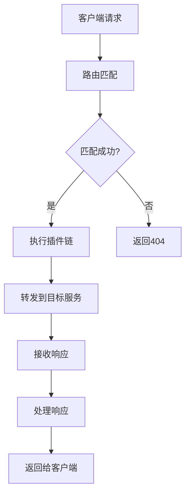

# 路由系统

## 概述

Gateway-Go 的路由系统负责请求的路由匹配和转发，支持多种匹配模式、负载均衡、健康检查等功能。路由系统采用优先级匹配机制，确保请求能够正确转发到目标服务。

## 路由匹配机制

### 匹配类型

路由系统支持四种匹配类型：

#### 1. 精确匹配 (exact)

完全匹配请求路径，适用于特定的API端点。

```yaml
routes:
  - name: health-check
    match:
      type: exact
      path: /health
    target:
      url: http://health-service:8080
```

**匹配示例**：
- 请求路径：`/health` ✅ 匹配
- 请求路径：`/health/` ❌ 不匹配
- 请求路径：`/health/status` ❌ 不匹配

#### 2. 前缀匹配 (prefix)

匹配路径前缀，适用于API版本控制和服务分组。

```yaml
routes:
  - name: api-v1
    match:
      type: prefix
      path: /api/v1
    target:
      url: http://api-v1-service:8080
```

**匹配示例**：
- 请求路径：`/api/v1/users` ✅ 匹配
- 请求路径：`/api/v1/orders/123` ✅ 匹配
- 请求路径：`/api/v2/users` ❌ 不匹配

#### 3. 正则匹配 (regex)

使用正则表达式匹配路径，提供最大的灵活性。

```yaml
routes:
  - name: user-api
    match:
      type: regex
      path: "^/api/users/(\\d+)$"
    target:
      url: http://user-service:8080
```

**匹配示例**：
- 请求路径：`/api/users/123` ✅ 匹配
- 请求路径：`/api/users/abc` ❌ 不匹配
- 请求路径：`/api/users/123/profile` ❌ 不匹配

#### 4. 通配符匹配 (wildcard)

使用通配符模式匹配，支持 `*` 和 `**` 通配符。

```yaml
routes:
  - name: static-files
    match:
      type: wildcard
      path: "/static/*"
    target:
      url: http://static-service:8080
```

**匹配示例**：
- 请求路径：`/static/css/style.css` ✅ 匹配
- 请求路径：`/static/js/app.js` ✅ 匹配
- 请求路径：`/api/static/css/style.css` ❌ 不匹配

### 主机匹配

除了路径匹配，还支持主机名匹配：

```yaml
routes:
  - name: tenant1-api
    match:
      type: prefix
      path: /api
      host: "*.tenant1.example.com"
    target:
      url: http://tenant1-service:8080
```

**匹配示例**：
- 主机：`api.tenant1.example.com` ✅ 匹配
- 主机：`www.tenant1.example.com` ✅ 匹配
- 主机：`api.tenant2.example.com` ❌ 不匹配

### 优先级机制

路由系统使用优先级机制处理多个匹配的路由：

```yaml
routes:
  # 高优先级路由（精确匹配）
  - name: specific-api
    match:
      type: exact
      path: /api/users/me
      priority: 100
    target:
      url: http://user-profile-service:8080

  # 低优先级路由（前缀匹配）
  - name: general-api
    match:
      type: prefix
      path: /api/users
      priority: 50
    target:
      url: http://user-service:8080
```

**优先级规则**：
- 数字越大，优先级越高
- 相同优先级的路由，按照配置顺序匹配
- 第一个匹配的路由会被选中

## 路由配置详解

### 完整路由配置

```yaml
routes:
  - name: api-service                    # 路由名称（必需）
    match:                               # 匹配规则（必需）
      type: prefix                       # 匹配类型
      path: /api                         # 匹配路径
      host: ""                           # 主机匹配（可选）
      priority: 90                       # 优先级（可选）
    target:                              # 目标配置（必需）
      url: http://backend:8080           # 目标服务URL
      timeout: 30000                     # 请求超时（毫秒）
      retries: 3                         # 重试次数
      retry_delay: 1000                  # 重试延迟（毫秒）
      health_check:                      # 健康检查配置（可选）
        enabled: true
        path: /health
        interval: 30                     # 检查间隔（秒）
        timeout: 5                       # 检查超时（秒）
        success_threshold: 1             # 成功阈值
        failure_threshold: 3             # 失败阈值
    plugins: ["auth", "rate_limit"]      # 插件列表（可选）
```

### 配置字段说明

#### 匹配配置 (match)

| 字段 | 类型 | 必需 | 默认值 | 说明 |
|------|------|------|--------|------|
| type | string | 是 | - | 匹配类型 (exact/prefix/regex/wildcard) |
| path | string | 是 | - | 匹配路径 |
| host | string | 否 | "" | 主机匹配模式 |
| priority | int | 否 | 0 | 优先级（数字越大优先级越高） |

#### 目标配置 (target)

| 字段 | 类型 | 必需 | 默认值 | 说明 |
|------|------|------|--------|------|
| url | string | 是 | - | 目标服务URL |
| timeout | int | 否 | 30000 | 请求超时时间（毫秒） |
| retries | int | 否 | 3 | 重试次数 |
| retry_delay | int | 否 | 1000 | 重试延迟（毫秒） |
| health_check | object | 否 | - | 健康检查配置 |

#### 健康检查配置 (health_check)

| 字段 | 类型 | 必需 | 默认值 | 说明 |
|------|------|------|--------|------|
| enabled | bool | 否 | false | 是否启用健康检查 |
| path | string | 否 | /health | 健康检查路径 |
| interval | int | 否 | 30 | 检查间隔（秒） |
| timeout | int | 否 | 5 | 检查超时（秒） |
| success_threshold | int | 否 | 1 | 成功阈值 |
| failure_threshold | int | 否 | 3 | 失败阈值 |

## 负载均衡

### 负载均衡策略

路由系统支持多种负载均衡策略：

#### 1. 轮询 (Round Robin)

```yaml
routes:
  - name: api-service
    match:
      type: prefix
      path: /api
    target:
      url: http://backend1:8080,http://backend2:8080,http://backend3:8080
      load_balancer:
        strategy: round_robin
```

#### 2. 权重轮询 (Weighted Round Robin)

```yaml
routes:
  - name: api-service
    match:
      type: prefix
      path: /api
    target:
      url: http://backend1:8080,http://backend2:8080
      load_balancer:
        strategy: weighted_round_robin
        weights: [70, 30]  # backend1占70%，backend2占30%
```

#### 3. 最少连接 (Least Connection)

```yaml
routes:
  - name: api-service
    match:
      type: prefix
      path: /api
    target:
      url: http://backend1:8080,http://backend2:8080,http://backend3:8080
      load_balancer:
        strategy: least_connection
```

#### 4. IP哈希 (IP Hash)

```yaml
routes:
  - name: api-service
    match:
      type: prefix
      path: /api
    target:
      url: http://backend1:8080,http://backend2:8080,http://backend3:8080
      load_balancer:
        strategy: ip_hash
```

### 健康检查与负载均衡

健康检查与负载均衡结合使用，确保流量只转发到健康的服务：

```yaml
routes:
  - name: api-service
    match:
      type: prefix
      path: /api
    target:
      url: http://backend1:8080,http://backend2:8080,http://backend3:8080
      load_balancer:
        strategy: round_robin
        health_check:
          enabled: true
          path: /health
          interval: 30
          timeout: 5
          success_threshold: 1
          failure_threshold: 3
```

## 请求转发

### 请求处理流程



### 请求头处理

网关会保留原始请求头，并添加一些内部头信息：

```yaml
# 添加的内部头信息
X-Forwarded-For: <client-ip>
X-Forwarded-Proto: <protocol>
X-Forwarded-Host: <original-host>
X-Gateway-Route: <route-name>
X-Gateway-Target: <target-url>
```

### 路径重写

支持路径重写功能：

```yaml
routes:
  - name: api-service
    match:
      type: prefix
      path: /api/v1
    target:
      url: http://backend:8080
      path_rewrite: /api  # 将 /api/v1/users 重写为 /api/users
```

## 错误处理

### 路由级错误处理

```yaml
routes:
  - name: api-service
    match:
      type: prefix
      path: /api
    target:
      url: http://backend:8080
      error_handling:
        timeout_fallback: http://fallback:8080
        circuit_breaker:
          enabled: true
          failure_threshold: 5
          recovery_timeout: 60
```

### 常见错误场景

1. **目标服务不可达**
   - 返回 502 Bad Gateway
   - 记录错误日志
   - 触发熔断器

2. **请求超时**
   - 返回 408 Request Timeout
   - 记录超时日志
   - 触发重试机制

3. **目标服务返回错误**
   - 透传错误状态码
   - 记录错误日志
   - 根据状态码决定是否重试

## 性能优化

### 路由匹配优化

1. **优先级排序**：按优先级对路由进行预排序
2. **缓存机制**：缓存匹配结果
3. **正则编译**：预编译正则表达式
4. **路径预处理**：预处理路径匹配

### 连接池管理

```yaml
routes:
  - name: api-service
    match:
      type: prefix
      path: /api
    target:
      url: http://backend:8080
      connection_pool:
        max_connections: 100
        max_idle_connections: 10
        idle_timeout: 90s
        connection_timeout: 30s
```

## 监控和指标

### 路由级指标

- 请求计数
- 响应时间
- 错误率
- 吞吐量
- 活跃连接数

### 健康检查指标

- 健康状态
- 检查成功率
- 响应时间
- 失败次数

## 最佳实践

### 1. 路由设计原则

- **明确性**：使用清晰的路径结构
- **一致性**：保持路径命名一致性
- **版本化**：使用版本号管理API
- **分层**：按功能模块组织路由

### 2. 性能优化建议

- **优先级合理**：为重要路由设置高优先级
- **缓存策略**：合理使用缓存
- **连接复用**：配置连接池
- **健康检查**：为关键服务启用健康检查

### 3. 安全考虑

- **访问控制**：使用插件控制访问权限
- **路径验证**：验证路径参数
- **请求限制**：配置限流和熔断
- **日志记录**：记录关键操作日志

### 4. 运维建议

- **监控告警**：设置路由级监控
- **配置管理**：使用配置版本控制
- **备份恢复**：定期备份路由配置
- **文档维护**：保持路由文档更新

## 常见问题

### Q: 路由匹配失败？
A: 检查以下几点：
- 路由配置是否正确
- 优先级设置是否合理
- 路径格式是否正确
- 主机匹配是否正确

### Q: 负载均衡不工作？
A: 可能原因：
- 目标服务不可达
- 健康检查失败
- 负载均衡策略配置错误
- 权重配置不正确

### Q: 请求转发失败？
A: 检查：
- 目标服务是否正常运行
- 网络连接是否正常
- 超时配置是否合理
- 重试机制是否生效

### Q: 性能问题？
A: 优化建议：
- 检查路由匹配性能
- 优化连接池配置
- 启用缓存机制
- 监控系统资源使用 